# Power BI Dashboard: Happiest Countries in 2015-2019

This repository contains a Power BI dashboard showcasing the happiness rankings and scores of countries from 2015 to 2019. The data used in this dashboard is derived from the World Happiness Report, an annual publication by the United Nations Sustainable Development Solutions Network.

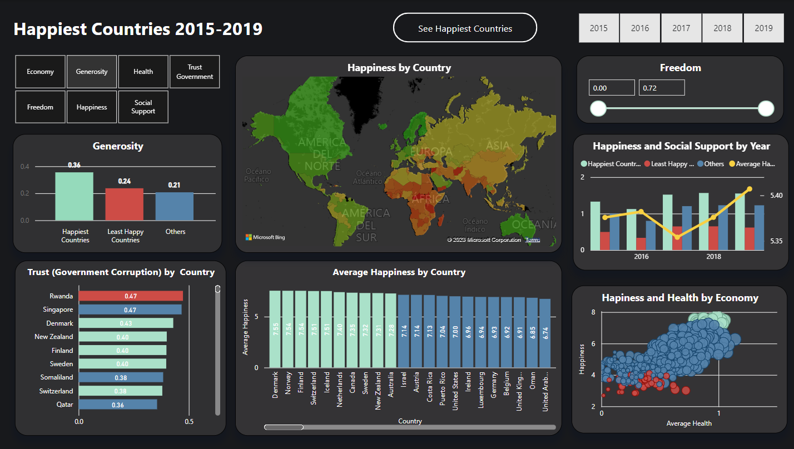

## Repository Structure

The repository is organized as follows:

- [Data](https://github.com/jenny-4/world-happiness/tree/main/data): This directory contains the datasets used for creating the Power BI dashboard. The data is stored in CSV (Comma-Separated Values) format and includes the happiness scores and rankings for each country in each year from 2015 to 2019.

- [Screenshots](https://github.com/jenny-4/world-happiness/tree/main/dashboard-images): This directory includes screenshots of the Power BI dashboard. The screenshots provide a preview of the visualizations and insights available in the dashboard.

- [Dashboard](https://github.com/jenny-4/world-happiness/blob/main/world-happiness.pbix): This directory holds the Power BI file (`*.pbix`) that contains the dashboard. You can download and open this file in Power BI Desktop to explore the visualizations and interact with the data.

## Dashboard Features
The Power BI dashboard offers the following features and visualizations:

- **Regional Happiness**: A map visualization showcasing the happiness scores across different regions of the world. This map provides a geographical perspective on happiness levels and regional variations.

- **Top 10 Countries Map Visualization**: Displays the top 10 countries based on the factor selected in the slicer. This interactive map visualization allows users to dynamically observe the countries with the highest scores for the chosen factor.

- **Comparative Analysis**: A bar chart allowing users to compare the happiness scores of multiple countries for a selected year. This visualization helps identify differences and similarities between countries in a specific year.

- **Correlation Analysis**: A scatter plot chart displaying the correlation between happiness scores and various factors such as GDP per capita and  life expectancy. This chart helps users understand the relationships between these factors and happiness.

- **Corruption Comparison**: A bar chart that enables users to compare corruption levels between countries. Users can select a specific year and view the corruption scores for different countries in a visually appealing format. This chart provides a clear comparison of corruption levels across countries, allowing users to identify countries with high or low perceptions of corruption. This visualization helps in analyzing the relationship between corruption and happiness, and understanding how corruption impacts the overall well-being of countries.

- **Comparing Scores Factors**: A bar chart that allows users to compare different scores factors between the happiest countries and the least happy countries based on the factor selected. Users can choose a specific factor such as GDP per capita, social support, life expectancy, freedom to make life choices, generosity, or perceptions of corruption. The chart visually presents the scores of the selected factor for the top 10 happiest countries and the bottom 10 least happy countries, allowing for easy comparison and identification of any significant differences. This visualization helps analyze how different factors contribute to happiness and understand the variations between the happiest and least happy countries.

- **Social Support and Happiness Trend**: A combined visualization consisting of a bar chart representing social support per year and a line chart depicting the happiness scores. The bar chart displays the average social support score for each year, allowing users to observe any trends or changes in social support over time. The line chart showcases the happiness scores for the same period, providing a clear understanding of the happiness trend. By viewing these two charts together, users can identify any potential correlations or patterns between social support and happiness. This visualization aids in exploring the relationship between social support and overall happiness levels over the years.

- **User Interaction**: The dashboard provides interactive features such as slicers, filters, and drill-through options, enabling users to explore the data from different angles and customize their viewing experience.

## Getting Started
### Introduction

The World Happiness Report measures and analyzes subjective well-being and happiness across countries. It takes into account various factors such as GDP per capita, social support, life expectancy, freedom to make life choices, generosity, and perceptions of corruption. This dashboard visualizes the happiness trends and provides insights into the happiest countries during the period from 2015 to 2019.

Within this project, I would like to explore the following:
1. Which countries consistently ranked among the top 10 happiest countries during the five-year period?
2. Which factors, such as GDP per capita, social support, life expectancy, freedom to make life choices, generosity, or perceptions of corruption, are strongly correlated with happiness?
3. Do regions with higher GDP per capita generally have higher happiness scores?
4. Are there any notable differences in the happiness scores between the happiest countries and the least happy countries?

### Analysis

Before delving into the analysis, it is important to note the color scheme employed in the dashboard, which categorizes the countries into three distinct groups. The 10 countries with the highest happiness scores are visually represented by a serene light blue shade. Conversely, the 10 countries with the lowest happiness scores are denoted by a red  hue. The remaining countries fall within the category represented by a deep, dark blue color. This color categorization facilitates a clear visual differentiation and enables users to easily identify and compare the happiness levels among different groups of countries throughout the dashboard.

In the map visualization presented below, countries depicted in green exhibit the highest happiness scores, while those appearing in  red represent the lowest happiness scores. Consequently, this visualization distinctly highlights that countries in Europe and America predominantly demonstrate higher happiness scores, while a significant number of the least happy countries are situated in Africa. This observation underscores the regional disparities in happiness levels across different continents.

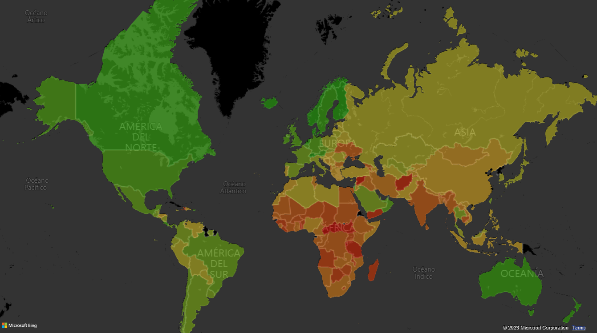

In the alternative map visualization provided, we can observe the top 10 countries with the highest scores. We can observe that the majority of these countries are located in Europe. This observation draws attention to the strong presence of European nations among the top performers in terms of overall happiness. 

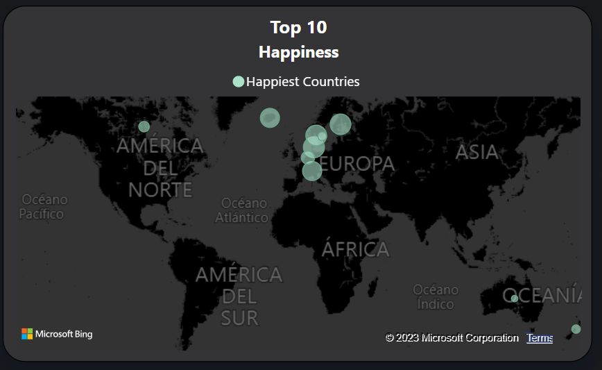

By analyzing the map visualization and referring to the accompanying bar chart below, we can identify the countries that consistently ranked among the top 10 happiest throughout the five-year period. It is worth noting that with the exception of Australia, all the countries in the top 10 maintained their position within the top 10 consistently.

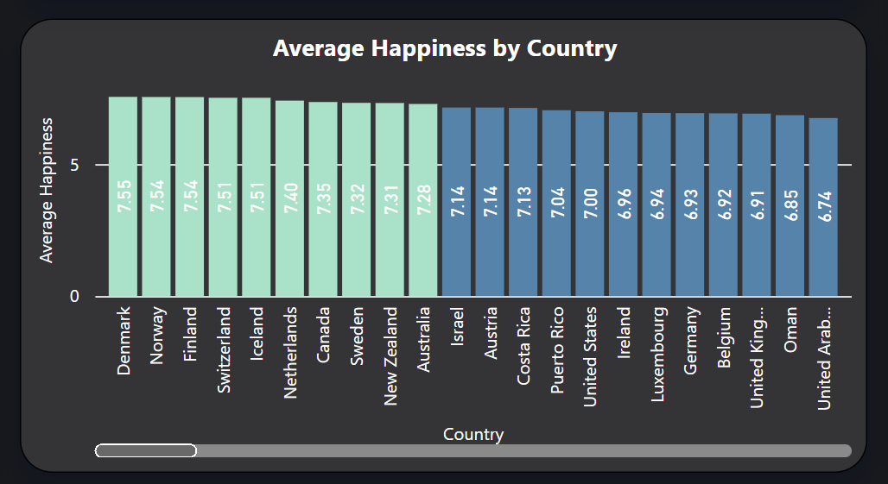

The top 10 countries with highest happiness scores are: 
1. Denmark
2. Norway
3. Finland
4. Switzerland
5. Iceland
6. Netherlands
7. Canada
8. Sweden
9. New Zealand
10. Australia

On the left side of the dashboard, a slicer is available to filter both the map visualization and the bar chart based on different factors. The bar chart presented below complements the slicer by displaying the scores of the selected factor across all three groups. By selecting happiness as the factor of interest the visualization reveals that the happiest countries consistently have scores that are more than twice as high as those of the least happy countries. This stark contrast emphasizes the substantial disparity in happiness levels between these two groups.

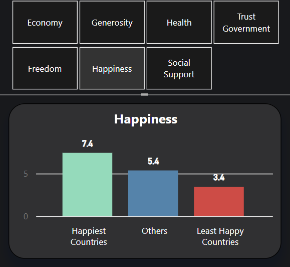

Positioned on the bottom left side of the dashboard, a horizontal bar chart allows for a comparison of corruption levels. This visualization provides insights into the relationship between corruption and happiness across countries.

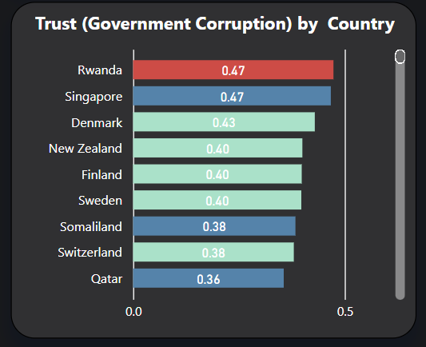

Upon analysis, it becomes apparent that 50% of the happiest countries also appear in the top 10 countries with the least corruption. This observation highlights a significant correlation between higher happiness scores and lower corruption levels. Notably, countries such as Finland, Denmark, New Zealand Switzerland and Sweden, which consistently rank among the happiest, also demonstrate low corruption levels.

Intriguingly, Rwanda, despite having one of the lowest happiness scores, stands out as the country with the least corruption. This unexpected finding underscores that while corruption can impact overall happiness, other factors also contribute to the well-being of a nation.

Located on the top right side of the dashboard, a slicer provides the ability to filter countries based on their freedom scores. 

By selecting the highest freedom scores in the slicer, we obtain a filtered view that showcases the happiest countries. This selection highlights the countries where higher levels of freedom coincide with greater happiness. Notably, these countries often exhibit strong respect for civil liberties, human rights, and personal freedoms.

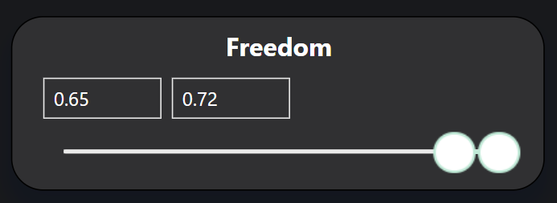{:height="50px"}
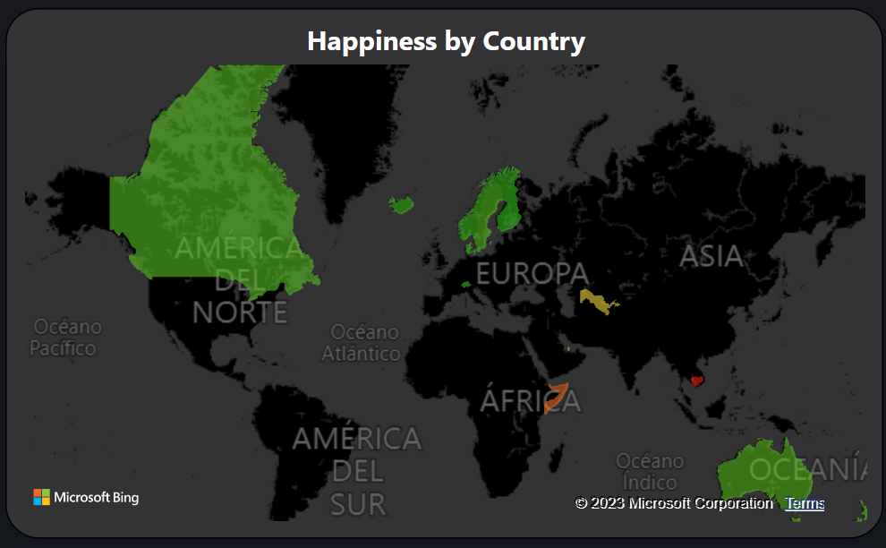

Conversely, by filtering the slicer to the lowest freedom scores, we obtain a filtered view that emphasizes the least happy countries. This observation implies that countries with lower levels of freedom often experience decreased happiness, indicating that restricted civil liberties and limited personal freedoms can impact overall well-being.

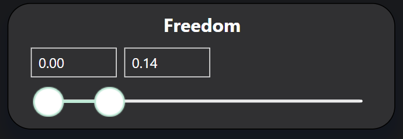{:height="50px"}

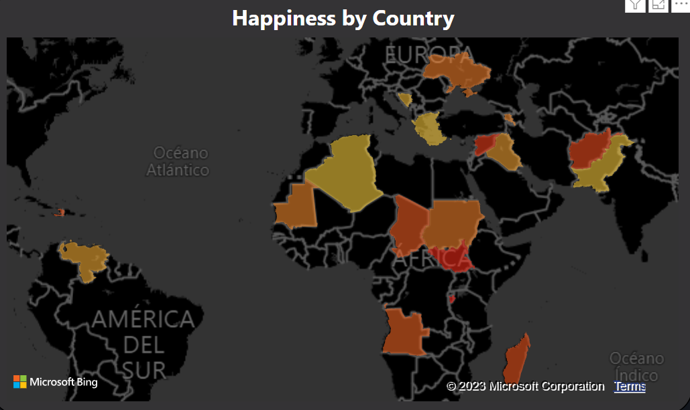

Lastly, we present a scatter plot that visualizes the relationship between happiness, economy, and life expectancy. In this plot, the size of the bubble indicates the economy of the respective country. This visualization allows us to examine the correlations between happiness and both economy and life expectancy.

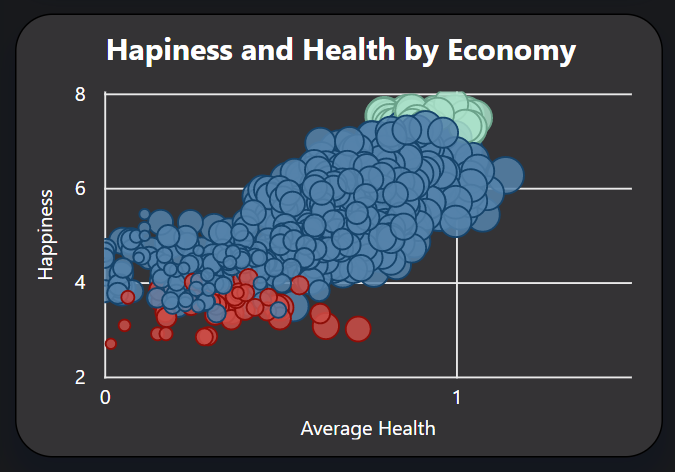

Upon analysis, we can observe a positive relationship between happiness and economy. Countries with higher economic indicators tend to have higher happiness scores, as indicated by the positioning of the bubbles. This suggests that economic prosperity plays a significant role in contributing to overall happiness levels.

Furthermore, we can also identify a positive correlation between happiness and life expectancy. Countries with longer life expectancies tend to exhibit higher happiness scores. 

### Conclusions
In this project, we have explored the happiness scores of countries from 2015 to 2019. We find the following:
- Denmark, Norway, Finland, Switzerland, Iceland, Netherlands, Canada, Sweden and New Zealand consistently ranked among the top 10 happiest throughout the five-year period.
- Almost all of these countries are in Europe.
- 50% of happiest countries are also in the top 10 countries with less corruption
- Happiest countries consistently have scores that are more than twice as high as those of the least happy countries.
- Happiness is correlated with higher life expectency(health), higher levels of freedom, a better economy (GDP per capita) and lower levels of corruption.